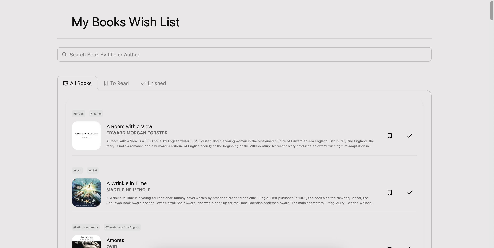

# Books Wish List

A clean and interactive book wishlist web app built with HTML, CSS, JavaScript, and Alpine.js.  
Users can browse a list of books, mark them as favorites, add them to a "To Read" list, and track finished readings.

## Features

- View all available books with cover, author, description, and subjects
- Add books to:
  - **To Read** list
  - **Readed** (Finished) list
  - **Favorite** list
- Toggle book status dynamically with responsive UI icons
- Smooth DOM rendering with Alpine.js
- Local mock API using JSON Server

## Tech Stack

- HTML / CSS / JavaScript
- Alpine.js
- JSON Server
- Git & GitHub

## Getting Started

- run `npm install` to install all packages.
- Run `npm run all` to launch:
   - Vite development server (default: port `5173`)
   - JSON Server (default: port `3002`)

## Development Tools
- Vite for development server